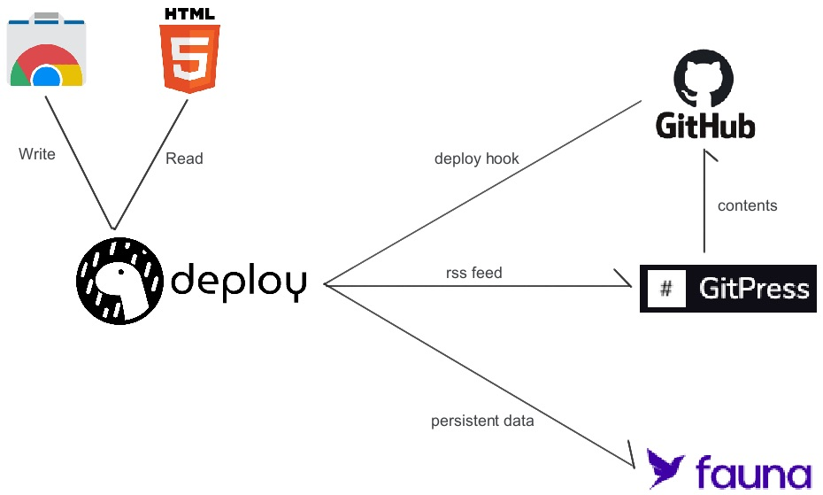

# Remarks

Measure the number of times that I have spoken, and publish it.  
In addition, my travelogue in China.

## Architecture



## Setup

### On Fauna

Dashboard > GraphQL > Upload [schema.gql](./schema.gql)

Then set `countRemarks` function as follows:


### Install Deno and deployctl

```bash
$ curl -fsSL https://deno.land/x/install/install.sh | sh
$ deno install --allow-read --allow-write --allow-env --allow-net --allow-run --no-check -f https://deno.land/x/deploy/deployctl.ts
```

## Run Server and Deploy

Open Fauna's Security dashborad, get new key.  
Execute as below:

```
$ FAUNA_SECRET=<secret> deployctl run --watch --libs=ns,fetchevent ./server.ts
```

All that is left is deploying on Deno Deploy.  
https://dash.deno.com/new

## GitPress

Hosting on [GitPress](https://gitpress.io), and reading rss feed.

Posts are placed in `/source` folder, so fill the directory with `/source`

## Chrome Extension

Post a request for what I said using it.

### Installation

1. Access to [chrome://extensions/](chrome://extensions/)
1. Click "LOAD UNPAKED"
1. Select `/chrome-extension` dir.

If fail it, add `--no-check` option.

## Local Develepment

### VSCode

- [Recommendations](/.vscode/extensions.json)
- Set your secret key using a `.faunarc` file for a project.\
https://github.com/fauna/vscode#1-set-your-secret-key

## Step by step

References

- [Deno deploy tutorial-faunadb](https://deno.com/deploy/docs/tutorial-faunadb)
- [Chrome拡張機能の作り方。誰でもかんたんに開発できる！](https://original-game.com/how-to-make-chrome-extensions/)
